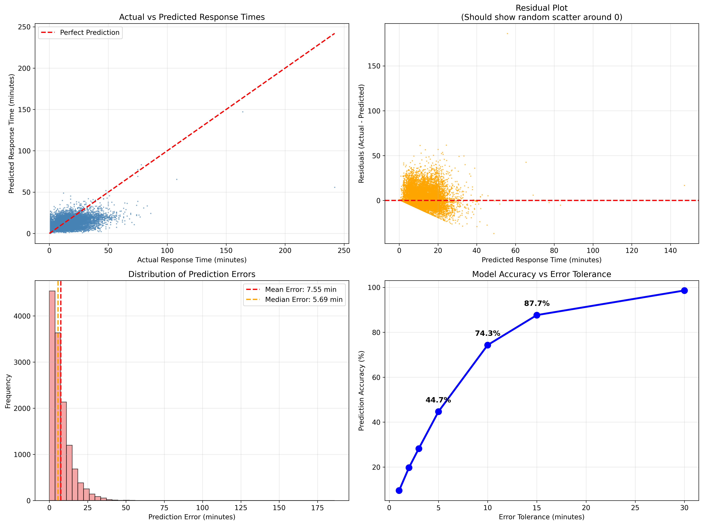

# Animal Control Response Time Prediction Using XGBoost

## Project overview

This project applies machine learning techniques to predict animal control response times using historical incident data. The original dataset contained 152,684 animal control incident records across 38 attributes. Significant data quality challenges included extensive missing values, inconsistent categorical labels, invalid timestamp values, duplicate records, and operational placeholder entries. The preprocessing pipeline reduced the dataset to approximately 65,000 high-quality records suitable for machine learning modeling.

The project focuses on real-world data preparation challenges including extensive missing values, inconsistent categorical data, invalid timestamps, and outlier removal. Multiple machine learning algorithms were evaluated, with XGBoost selected as the final model due to its combination of predictive performance, scalability, and ability to handle missing values.

## Project Objectives

- Predict animal control response times based on incident characteristics.
- Clean and normalize a large real-world dataset containing significant data quality issues.
- Engineer new predictive features through clustering and temporal analysis.
- Compare multiple machine learning algorithms to identify the best-performing solution.
- Evaluate the practical value of AI/ML for improving operational efficiency and resource allocation.

## Results

Four machine learning approaches were evaluated:

| Model | MAE (minutes) |
|--------|--------------:|
| Linear Regression | 8.10 |
| Random Forest Regressor | 7.60 |
| XGBoost | 7.55 |
| Simple Average Ensemble | 7.51 |

Although the ensemble achieved slightly better performance, XGBoost was selected because it provided nearly equivalent accuracy with substantially lower complexity and maintenance requirements.

### Final XGBoost Performance
- MAE: 7.55 minutes
- Accuracy within 5 minutes: 44.7%
- Accuracy within 10 minutes: 74.3%
- R² Score: 0.168

### Prediction Analysis



## Key Features

- Extensive data cleaning and normalization pipeline
- Missing value handling without imputation where appropriate
- Time-based feature engineering
- K-Means clustering for breed complexity analysis
- Temporal pattern clustering
- Hyperparameter-optimized XGBoost regression
- Model comparison across multiple algorithms
- Feature importance and interpretability analysis
- Business impact assessment and operational recommendations

## Technologies Demonstrated

- Machine Learning
- XGBoost Regression
- Data Cleaning and Validation
- Feature Engineering
- K-Means Clustering
- Hyperparameter Optimization
- Model Evaluation

## Dataset

The original dataset contained over 152,000 entries with 38 attributes. Significant preprocessing was required due to missing values, inconsistent category naming, placeholder timestamps, and extreme outliers. Because of this, the dataset was reduced to approximately 65,814 entries. Of the 38 attributes, 10 were selected for being the most relevant to the goals of the project: incident timestamps, dispatch timestamps, arrival timestamps, availability timestamps, request type, species, breed, sex, age, and disposition

## Model Architecture

Animal Control Incident
          ↓
    Feature Vector
          ↓
 ┌───────────────────┐
 │ XGBoost Regressor │
 │ • 300 Estimators  │
 │ • Max Depth = 10  │
 │ • Learning Rate   │
 │ • L1/L2 Regular.  │
 └───────────────────┘
          ↓
Response Time Prediction
          ↓
Resource Allocation &
Operational Planning

## Dependencies

- **Language**: Python 3
- **Libraries**:

  - pandas (data cleaning and manipulation)
  - numpy (numerical computing)
  - scikit-learn (preprocessing, clustering, model evaluation, and baseline models)
  - xgboost (gradient boosting regression)
  - matplotlib (visualization and model interpretability)
  - pickle (model and dataset serialization)
  - os (file operations)
  - time (performance measurement)
  - warnings (warning management)

## Repository Structure

## Repository Structure

```text
Animal_Control_XGBoost_Prediction/
├── README.md                             # This file
├── Data_Preparation.py                   # Contains code for data preparation
├── XGBoost_Model.py                      # Contains code for the final XGBoost model
├── Model_Comparison.py                   # Contains the comparison between tested models
├── Animal_Control_Incidents_dataset.csv  # The original dataset
├── Images/                               # Contains image for illustrative purposes
│   └── prediction_analysis.png
└── Project_Report.pdf                    # Final report on project
```

## Usage

1. Run the data preparation pipeline:

```bash
python Data_Preparation.py
```

2. Compare candidate models:

```bash
python Updated_Model_Comparison.py
```

3. Train and evaluate the final XGBoost model:

```bash
python Final_Model.py
```

## Future Improvements

- Incorporating geographic distance and traffic information.
- Expanding the dataset with additional incident records.
- Improving data collection procedures to reduce missing values.
- Exploring advanced ensemble methods.
- Integrating image-based animal identification using deep learning.
- Deploying the model as a web-based decision support tool.